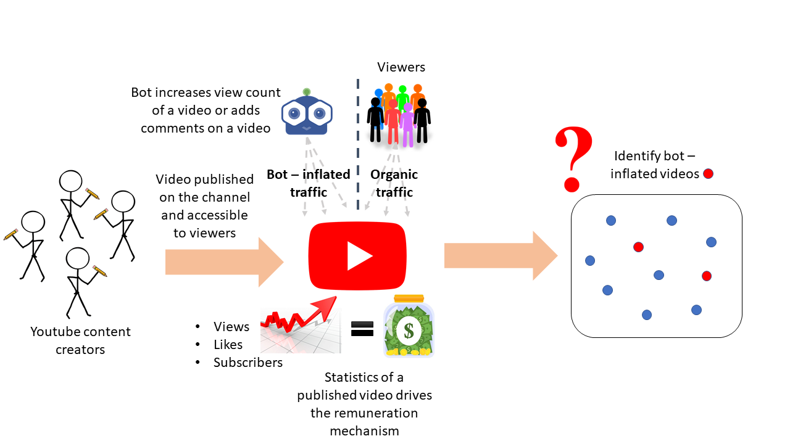

# Detecting bot-inflated videos on Youtube

Abstract

Youtube has emerged as one of the social media platforms for creators to publish content and monetize it through their increasing audience and viewership. In the race of coming in limelight, few creators try to improve the statistics of published content like number of views, subscribers, likes, etc. through automated scripts or bots. This is a concern for two reasons - a) inflated views lead to disparity among the genuine creators, gaining popularity via organic traffic and others resorting to bot inflation for fame, thus abusing the remuneration mechanism b) ad impressions which work only in case of user interactions like clicks, get wasted due to the activity of view bots, taking a toll on the youtube advertisers. Hence, it is important to solutionize the problem by analyzing the social media interactions and penalize the fake popularity seekers for violating the terms of service. This would also help businesses to get finer insights from their consumer base and not get misled by popularity of certain content.  

Keywords

video bot inflation, view/comment bot, organic traffic, fake popularity, youtube data analytics

